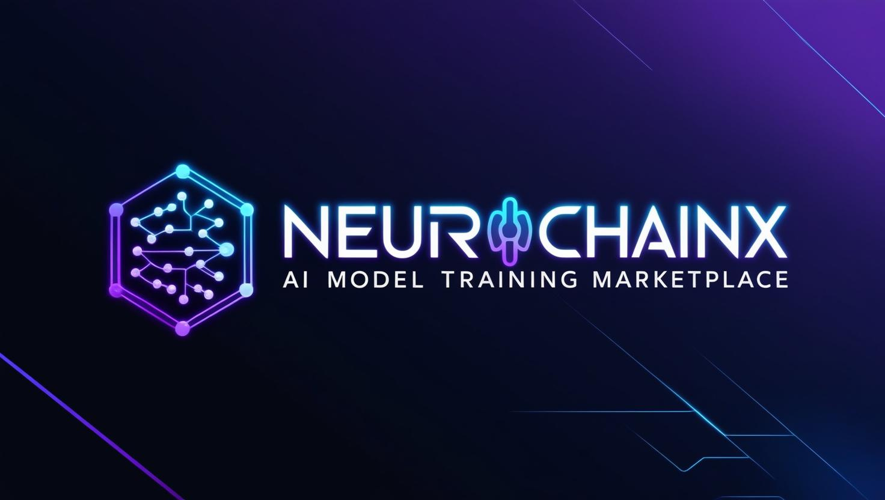

# NeuroChainX - AI Model Training Marketplace



A decentralized marketplace for AI training datasets built with Next.js, Calimero SDK, and Internet Computer Protocol (ICP). The platform leverages ICP's robust infrastructure for secure transactions, Calimero for encrypted data storage, and supports over 600 wallets via Coinbase and WalletConnect.

This project was developed for the **[Calimero x ICP Hackathon](https://dorahacks.io/hackathon/calimero-x-icp/detail)**, an initiative to push the boundaries of secure, decentralized AI training solutions.

---

## 🔍 About Calimero & Internet Computer (ICP)

### 🌐 Internet Computer (ICP)
The **Internet Computer Protocol (ICP)** is a blockchain network designed for high-speed, scalable decentralized applications. It allows for smart contract execution on-chain, ensuring transparency, security, and reduced reliance on traditional cloud services.

### 🔒 Calimero SDK
**Calimero** provides encrypted data storage and private shards, ensuring that AI training datasets remain secure and accessible only to authorized users. With seamless blockchain integration, it enables efficient data management and privacy-first computations.

---

## 🚀 Features

- 🔐 **Secure dataset storage** with Calimero encryption  
- 💰 **Multi-wallet support** (600+ wallets via WalletConnect & Coinbase)  
- 🤖 **AI model integration** for seamless dataset training  
- 🎨 **Modern UI** with neural network animations  
- 🔒 **Decentralized authentication** using Internet Identity  
- 📱 **Responsive design** for all devices  
- 🌐 **Internet Computer (ICP) smart contract execution**  
- 🔄 **Calimero-powered encrypted data sharing**  

---

## 🛠 Tech Stack

- **Frontend**: Next.js, TypeScript, Tailwind CSS, shadcn/ui  
- **Blockchain**: Internet Computer Protocol (ICP)  
- **Storage**: Calimero SDK (Encrypted AI dataset storage)  
- **Authentication**: Internet Identity  
- **Smart Contracts**: Rust-based ICP Canisters  
- **Wallet Support**: WalletConnect (600+ wallets), Coinbase, Plug, MetaMask, Phantom  

---

## 🏗 Architecture

### Frontend (Next.js)
- Built with modern React and TypeScript  
- Neural network-themed UI components  
- Client-side ICP and WalletConnect integration  
- Responsive Tailwind CSS design  
- Advanced animations and effects  

### Backend (Internet Computer)
- Rust-based smart contracts (canisters)  
- Secure dataset management with ICP  
- Payment processing and access control  
- Integration with Calimero SDK for encrypted storage  

---

## 🚀 Quick Start

1. Install dependencies:
   ```bash
   npm install
   ```

2. Set up environment variables:
   ```bash
   # Internet Computer
   IC_HOST=https://ic0.app
   IC_CANISTER_ID=your_canister_id
   ```

3. Install Wallets:
   - [Plug Wallet](https://plugwallet.ooo/)
   - [MetaMask](https://metamask.io/)
   - [Coinbase Wallet](https://www.coinbase.com/wallet)
   - [Phantom Wallet](https://phantom.app/)

4. Start the development server:
   ```bash
   npm run dev
   ```

---

## 💳 Multi-Wallet Support (600+ Wallets)

1. Install **Plug Wallet**, **MetaMask**, **Coinbase Wallet**, **Phantom Wallet**, or **any WalletConnect-supported wallet**.
2. Create or import an existing wallet.
3. Fund your wallet with ICP or supported tokens.
4. Connect your wallet to NeuroChainX.
5. Purchase datasets with seamless one-click transactions.

---

## 🔐 Security Features

- 🔑 **End-to-end encryption** with Calimero SDK  
- 🔐 **Secure authentication** via Internet Identity  
- 📜 **Smart contract-based access control**  
- 🔄 **Encrypted data storage & transfer**  
- 💳 **Multi-wallet secure transactions**  

---

## 📦 Smart Contract Development

1. Install Rust toolchain:
   ```bash
   curl --proto '=https' --tlsv1.2 -sSf https://sh.rustup.rs | sh
   ```

2. Install DFX SDK:
   ```bash
   sh -ci "$(curl -fsSL https://internetcomputer.org/install.sh)"
   ```

3. Deploy smart contracts:
   ```bash
   dfx deploy --network ic
   ```

---

## 🌍 Production Deployment

1. Build the application:
   ```bash
   npm run build
   ```

2. Deploy to Internet Computer:
   ```bash
   dfx deploy --network ic
   ```

---

## 🤝 Contributing

1. Fork the repository.
2. Create a feature branch.
3. Commit your changes.
4. Push to the branch.
5. Open a Pull Request.

---

## 📄 License

Released under the [**MIT License**](./LICENSE).

---

  
*"We all change. When you think about it, we are all different people all through our lives. And that's okay. That's good. You've got to keep moving so long as you remember all the people that you used to be."* – The Doctor.

